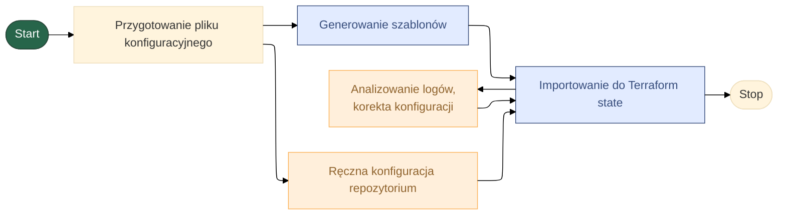
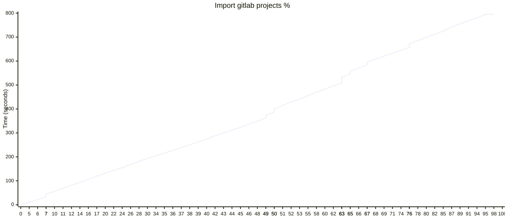
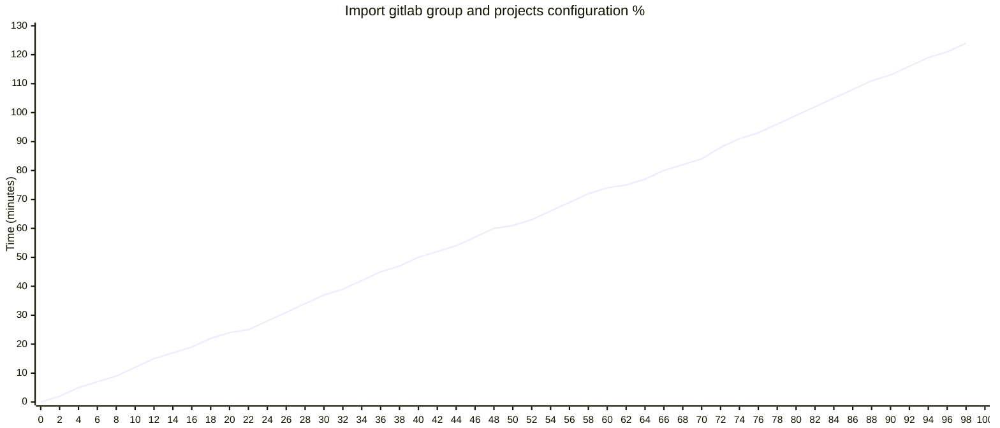

## 🏗️ Terraform - IAC - GITLAB
Moduł do pracy z Terraform, oferujący:



**Generowanie konfiguracji**
- [Automatyczne generowanie definicji Terraform dla grupy GitLab](/ddocs/terraform/gitlab/generate/main.md)
- [Automatyczne generowanie definicji Terraform dla projektu GitLab](/ddocs/terraform/gitlab/generate/main.md)
- [Automatyczne generowanie definicji Terraform dla grupy wraz z jego dziećmi GitLab](/ddocs/terraform/gitlab/generate/main.md)

**Import zasobów:**
- Import istniejących zasobów GitLab do stanu Terraform](/docs/terraform/gitlab/import/main.md)


--- 
## Ręczna konfiguracja

1. Ustawienie providera
2. Ustawienie data [opcjoalnie] (np. kiedy integrujesz się z vault)
3. Dodanie katalogu `images`
4. Dodanie katalogu plików z parametrami (`data/allowed_avatar_group_types.json`, `data/allowed_avatar_project_types.json`, `data/allowed_project_types.json`)


## Analiza wyników importu

> [!important] Założenia
> 1. Użycie terraform import bezpośrednio do gitlab State w projekcie
> 2. Próbka danych 741 resources (11 group, 62 repozytoria)
> 3. Najwolniejszym elementem procesu jest wykonywanie polecenia `terraform import` (741x użyto polecenia)
> 4. Najpierw importowane są grupy, później repozytoria, a na końcu wszystkie parametry


**Import grup**
```mermaid
---
config:
    xyChart:
        width: 1400
        height: 600
        showDataLabel: true
---
xychart-beta
    title "Import gitlab groups %"
    x-axis [4.6, 4.7, 4.9, 5.0, 5.1, 9.6, 32.3, 33.0, 34.1, 47.1, 47.2, 51.9, 100.0]
    y-axis "Time (seconds)" 0 --> 140
    line [0.0, 11.555639, 22.721878, 34.639242, 46.282138, 58.05492, 69.757065, 81.091021, 92.414706, 105.62931, 118.580053, 131.889031, 131.890342]
```


**Import projektów**


**Import ustawień grup i repozytoriów**
