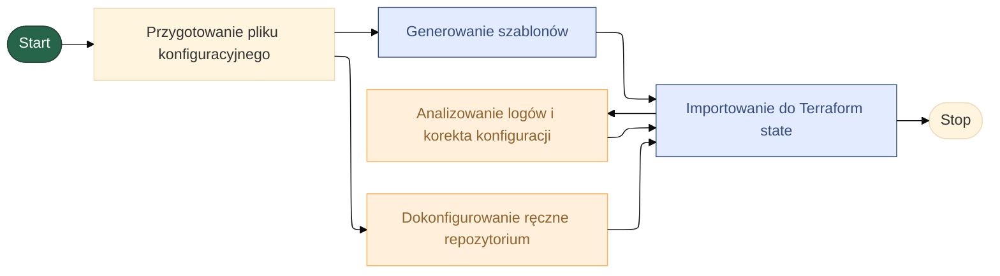

## 🏗️ Terraform - IAC - GITLAB
Moduł do pracy z Terraform, oferujący:

---
## Generatory

1. [IAC-GITLAB](/docs/terraform/gitlab/gitlab   /main.md)

---
## Importery:

1. [IAC-GITLAB](/docs/terraform/gitlab/import/main.md)